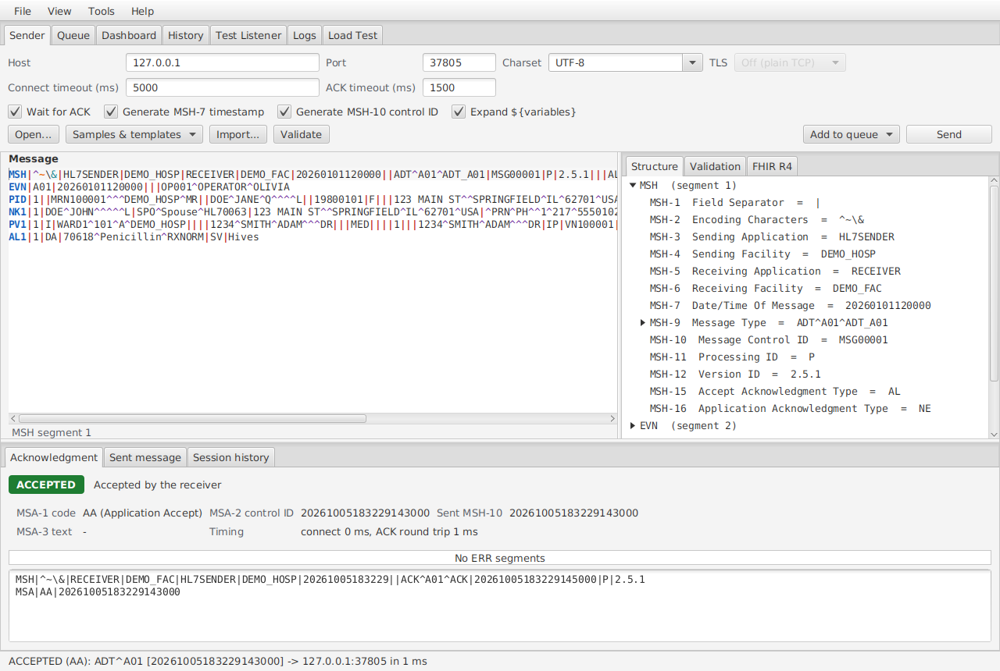
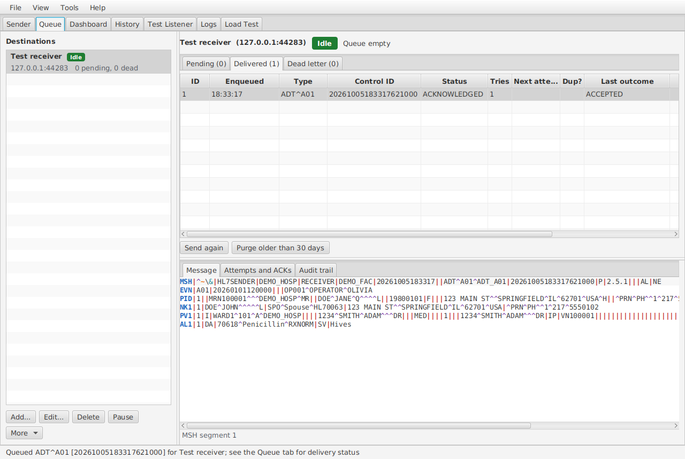
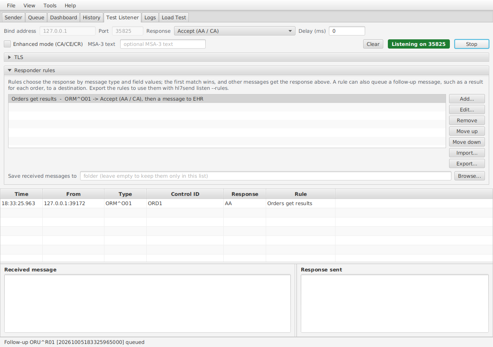
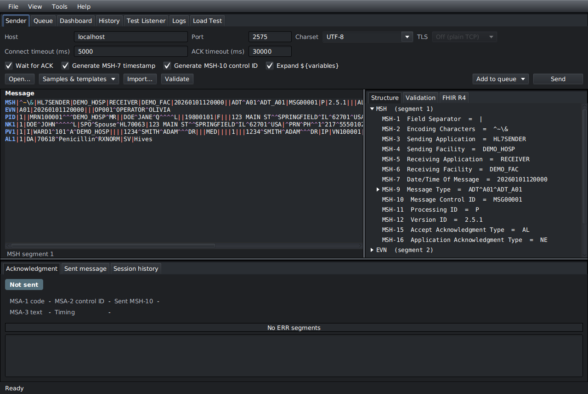

# HL7 Message TCP Sender

[](https://github.com/vijayamirtharajxavier/hl7-message-tcp-sender-multiple-os-supported/actions/workflows/ci.yml)
[](LICENSE)


A free, cross-platform desktop app and command-line tool (Windows, macOS, Linux) for sending HL7 v2 messages over
TCP/MLLP to EHRs, Mirth Connect and Apache NiFi. It checks acknowledgments (ACK/NACK), keeps a durable queue so no
message is lost, and includes a test listener that can play the receiving system. The installers bundle their own
Java runtime, so nothing else needs to be installed.



| Durable queue with retries and audit trail | Test listener with responder rules | Dark theme |
|---|---|---|
| [](docs/images/queue.png) | [](docs/images/test-listener.png) | [](docs/images/dark-theme.png) |

> **Status: 1.0.0.** The sender, desktop app and CLI, the durable queue, bulk import and templates, TLS and
> multiple destinations, monitoring, headless operation, native installers, load testing, responder rules,
> schedules, scripting, plugins, FHIR R4, users and roles, and a shared PostgreSQL queue.
> See [CHANGELOG.md](CHANGELOG.md).

## Features

**Sending**
- HL7 v2 over **MLLP** (`<VT> message <FS><CR>`) with connect and ACK timeouts. The ACK timeout is a total deadline, so a slow or stalled receiver cannot extend it indefinitely.
- Optional generation of **MSH-7** (timestamp) and **MSH-10** (unique 20-character control ID). The rest of the message is sent exactly as written.
- Accepts pasted text with LF, CRLF or CR line endings. Supports configurable character sets (UTF-8, ISO-8859-1, windows-1252, ...).
- A "no ACK" mode for receivers that never acknowledge, such as a plain NiFi `ListenTCP` flow.

**Acknowledgments**
- Original (`AA`/`AE`/`AR`) and enhanced (`CA`/`CE`/`CR`) codes.
- **Application ACKs** in enhanced mode: after a `CA`, a message whose MSH-16 is AL, ER or SU waits as
  `AWAITING_APP_ACK` until the receiver's later AA/AE/AR arrives on the destination's application ACK port, matched
  by MSA-2. AE/AR, or no application ACK in time, sends it to the dead-letter queue; with ER, silence means success.
- The ACK is matched to the message by **MSA-2 = MSH-10**. A mismatch is reported, not treated as success.
- **ERR segments** are decoded in both the v2.5+ layout and the older layout.
- Every outcome is classified and colour-coded:

| Outcome | Colour | Meaning | Default queue policy |
|---|---|---|---|
| `ACCEPTED` | green | AA / CA | - |
| `SENT_NO_ACK` | green | sent in no-ACK mode | - |
| `APPLICATION_ERROR` | red | AE: the content was rejected | no retry, goes to the dead-letter queue |
| `APPLICATION_REJECT` | red | AR: the receiver refused it | retry |
| `COMMIT_REJECT` | red | CR: the receiver does not accept the message type (MSH-9), version (MSH-12) or processing ID (MSH-11) | no retry, goes to the dead-letter queue |
| `COMMIT_ERROR` | red | CE: the receiver could not commit it for another reason, such as a sequence number error | retry |
| `CONTROL_ID_MISMATCH` | amber | ACK is for a different message | retry |
| `INVALID_ACK` | amber | response is not an HL7 ACK | retry |
| `ACK_TIMEOUT` | amber | no ACK within the timeout | retry |
| `CONNECTION_CLOSED` | amber | receiver hung up without an ACK | retry |
| `CONNECTION_FAILED` / `SEND_FAILED` / `PROTOCOL_ERROR` | red | network or framing failure | retry |
| `VALIDATION_FAILED` | red | not sent: structural error | no retry |

**Durable queue (store-and-forward)**
- Messages added to a destination's queue are stored in a local SQLite database **before** they are sent. Nothing is lost if
  the app crashes, the machine restarts or the receiver is down.
- **Strict FIFO** per destination with one message in flight, which preserves HL7 event order.
- **Retry** with exponential backoff and jitter, and a maximum number of attempts (or unlimited). The same MSH-10 is used on every retry
  so the receiver can de-duplicate.
- **Circuit breaker**: after N consecutive failures, delivery pauses for a cool-down period, then tries one probe message.
- **Configurable ACK policy per destination**: retry or dead-letter on AR, AE, CR, CE, and timeout / invalid ACK.
- **Dead-letter queue**: inspect the ACK and ERR details, edit the message, re-queue, delete, or export to JSON.
- **Crash recovery**: a message caught mid-send is retried on restart and flagged as a *possible duplicate*.
- Persistent connections with automatic reconnect. The connection is dropped after any ambiguous response so a late ACK can
  never be matched to the wrong message.
- **Audit trail** of every state change (who, when, from, to, why), plus attempt history with raw ACKs.
- Pause and resume per destination, *Retry now*, and *Move to dead letter* to unblock the head of a queue.

**Bulk, batch and automation**
- **Import** files, whole folders, or N copies of a template into a destination's queue. The import shows progress,
  can be cancelled, and then tracks delivery of the batch.
- Reads **HL7 batch files** (`FHS/BHS … BTS/FTS`, with trailer count checks), back-to-back messages with any line
  endings, and MLLP-framed captures.
- **Folder watch** per destination: files dropped in a folder are queued automatically and moved to `processed/`
  (or `error/` with a report).
- **Rate limit** per destination (messages per second) to protect receivers.
- 10,000 messages from one batch file import in about 12 s, with full validation.

**Security and multiple destinations**
- **MLLP over TLS** and **mutual TLS** per destination: trust store (PKCS12, JKS or PEM, or the system CAs),
  optional client certificate, hostname verification, and allowed protocols (TLS 1.3 and 1.2 by default).
- **Certificate expiry warnings** 30 days ahead: on the Queue tab, in the status bar at startup, and in the
  audit trail. *Check certificates* in the destination dialog lists every certificate and its expiry date.
- **Passwords in the OS keychain** (macOS Keychain, Windows Credential Manager, GNOME Keyring / KWallet), never in
  settings, the database or exported files. See **Help > Security**.
- Optional **encryption at rest** of the queue database (SQLCipher, AES-256), with a recovery key.
- **Presets** for Mirth Connect, Apache NiFi, an EHR and the local test listener, each with setup notes, and
  free-text **notes** per destination.
- **Export and import destinations** as JSON profiles to share a setup (no passwords or messages included).
- **Fan-out**: queue the same message for several destinations; each copy is delivered and tracked on its own.
- The **Test Listener** can also listen over TLS and require client certificates.

**Monitoring and alerts**
- **Dashboard**: every destination's state, queue depth, in-flight and dead-letter counts, accepted
  messages per minute, accept and NACK rates, and average and maximum ACK latency over the last 15 minutes,
  hour or day. Each card has a per-minute throughput chart, and recent alerts are listed below.
- **Alerts** when new messages are dead-lettered (with a threshold), when a destination's circuit breaker opens
  (and when it recovers), and when a TLS certificate expires within 30 days. They are delivered as
  **desktop notifications**, to a **webhook** (Slack and Microsoft Teams compatible JSON) and by **e-mail**
  (SMTP with STARTTLS/SSL). Alerts carry names and counts only, never message content. Set them up in
  **Tools > Alerts and notifications** and try them with **Send test alert**.
- **Logs** tab: the live application log, filtered by level and text.
- **Diagnostics bundle** (Tools menu or Logs tab): a zip for support with system info, settings, destinations,
  queue counts, recent alerts and logs. Passwords, webhook tokens and message content are left out, and anything
  that looks like a credential in the logs is masked.

**Templates**
- `${NOW}`, `${NOW:yyyyMMdd}`, `${TODAY}`, `${SEQ}`, `${SEQ:6}`, `${UUID}`, `${CONTROL_ID}`, `${RANDOM:n}`,
  `${RANDOM_MRN}`, `${RANDOM_FIRST_NAME}`, `${RANDOM_LAST_NAME}`, `${RANDOM_DOB}`, `${RANDOM_SEX}`. Each variable has
  one value per message and a new value for the next message.
- Built-in samples (ADT A01/A03/A04/A08, ORM, ORU, SIU, MDM, DFT) and templates. Save your own as plain `.hl7` files.

**Validation**
- Per destination: **Lenient** (structure only), **Standard** (HAPI findings are warnings) or **Strict** (findings
  block), plus an optional **HL7 conformance profile** (Messaging Workbench XML) for usage and cardinality rules.
- Structural checks block sending: MSH first, delimiters, MSH-9, MSH-12, segment names, one message only.
- HAPI checks structure and data types against the declared version (v2.1–v2.8.1). HAPI findings are warnings only.

**Desktop app**
- **Syntax-highlighted editor** with field names on hover and in a location bar, for example
  `PID-5.1 Patient Name > Family Name (XPN) = DOE`. Names come from the message's own HL7 version.
- **History** tab: search every message by destination, status, type, control ID, text, import batch and date.
  Export to CSV (metadata only) or JSON (with content).
- **Queue** tab: destinations with live status (idle / sending / waiting to retry / circuit open / paused) and
  Pending / Delivered / Dead-letter views. Each message shows its payload, attempts, ACKs and audit trail.
  Use **Add to queue** on the Sender tab to queue the editor's message.
- Message editor with a live segment/field/component tree and validation panel.
- Built-in samples (ADT^A01, ADT^A08, ORM^O01, ORU^R01) with fictitious data. Can open `.hl7` files.
- Response panel showing MSA-1, MSA-2, MSA-3, ERR, the raw ACK, the exact message sent, timings and session history.
- **Test Listener** tab: a mock MLLP receiver that can accept, error, reject, send the wrong control ID, send a malformed response, stay silent, or close the connection, with an optional delay. Settings change live while it runs.

**Testing and simulation**
- **Load Test** tab and `hl7send load`: N connections at a target rate for a count or a duration, with throughput,
  ACK latency percentiles (p50/p95/p99/max), outcomes, live charts, pass/fail thresholds and a JSON report.
- **Responder rules** on the Test Listener: answer by message type and field values, send custom responses, save
  received messages, and queue **follow-up messages** (for example an ORU for every order) with values copied from
  the message answered (`${IN:PID-3.1}`). Rules export as JSON for `hl7send listen --rules`.
- **Scheduled sends** (Tools > Scheduled sends, `hl7send schedule`): cron expressions with time zones, copies per
  run, and new control IDs every run. **Replay** from History or `hl7send replay`, to the same or another
  destination.

**Transforms, transports and FHIR**
- **Transform scripts** per destination: JavaScript run on each message as it is queued, like a Mirth
  transformer (`msg.set('MSH-6', 'TESTFAC')`, `msg.remove('NK1')`, `filter(...)`), in a sandbox with a time limit.
- **Transports**: besides MLLP, a destination can send over **HTTP(S)**, to a **folder**, or to a **FHIR R4**
  server, with the same queue, retries and dead-letter handling. More (SFTP, brokers) can be added as **plugins**
  (see `examples/transport-plugin`).
- **HL7 v2 to FHIR R4**: a live preview of the transaction Bundle on the Sender tab (Patient, Encounter,
  RelatedPerson, AllergyIntolerance, Condition, DiagnosticReport and Observations, ServiceRequest), and
  `hl7send fhir convert|send`.

**Teams**
- **Shared PostgreSQL database** (Tools > Queue database, `hl7send database`): several computers work on one
  queue, with one delivering at a time and automatic take-over.
- **Users and roles** (viewer, operator, admin): sign-in for the app and the CLI, hidden controls for what a
  role may not do, and the user's name in the audit trail. Off until the first user is added.

**Look and feel**
- Light and **dark** themes (View > Theme), with WCAG AA contrast for status colours.
- Keyboard shortcuts: Ctrl+1…7 switch tabs, F5 refreshes, Ctrl+Enter sends, F1 lists all shortcuts.
- Screen-reader labels on the editor, tables, dashboard cards and status messages.
- English and Spanish (View > Language) for the menus, tabs and newer screens.
- A **welcome wizard** on first start: create a destination (or use the built-in test listener), test the
  connection, and send a sample message.

**Command line and automation**: `hl7send` sends, validates, listens, and works with the same queue as the app
(`queue`, `dlq`, `destination`), with `--json` output and CI-friendly exit codes. `hl7send serve` delivers without a
window and installs as a service; a local REST API lets test harnesses queue and track messages. See
[Command line](#command-line-hl7send).

**Logging**
- Rolling application log plus a separate warnings/errors log.
- **Message content is never logged** (PHI). Only type, control ID, outcome and timing are recorded.

## Install

Download the installer for your system from
[Releases](https://github.com/vijayamirtharajxavier/hl7-message-tcp-sender-multiple-os-supported/releases): `.msi` (Windows, per-user,
no administrator rights), `.dmg`/`.pkg` (macOS, Apple silicon), `.deb`/`.rpm`, `.AppImage` or `.tar.gz` (Linux
x64). They include their own Java runtime and install both the app and `hl7send`. See the
[user guide](docs/user-guide.md#install) for details.

**Help > Check for updates...** (or `hl7send update`) tells you when a newer release is out. The daily automatic
check is off until you turn it on, and nothing is downloaded automatically.

## Documentation

- [User guide](docs/user-guide.md): installing, sending, destinations and the queue, TLS, monitoring. It starts
  with the [road map of how a message travels](docs/user-guide.md#how-a-message-travels).
- [Destination settings by transport](docs/destination-settings.md): which settings MLLP, HTTP(S), folder and FHIR R4
  destinations use, and what each one means.
- [Administrator guide](docs/admin-guide.md): silent installs, data locations, PHI, services, backup, updates.
- [Troubleshooting](docs/troubleshooting.md): ACK outcomes, common AE/AR causes, TLS handshake failures.
- [Contributing](CONTRIBUTING.md): building, packaging and releasing.

## Quick start (from source)

Requires **JDK 21**.

```bash
./gradlew :app:run                                  # desktop app
./gradlew build                                     # full build: tests, Checkstyle, SpotBugs
./gradlew :core:slowTest                            # 10,000-message load test (about a minute)
./gradlew :cli:installDist                          # CLI → cli/build/install/hl7send/bin/hl7send
./gradlew :app:jpackageInstaller                    # installer for this OS → app/build/jpackage/installer
```

To build the installers for Ubuntu, Windows or macOS, run `scripts/package.sh` (Linux, macOS) or
`scripts\package.ps1` (Windows) on that system; see [Building installers](CONTRIBUTING.md#building-installers).

### Try it without a real receiver

On first start, the welcome wizard starts the test listener, creates a destination for it and sends a sample
message through the queue. To explore by hand:

1. Start the app, open **Test Listener**, choose a response and click **Start** (port 2575 by default).
2. On the **Sender** tab, set host `localhost` and port `2575`, pick a sample and click **Send** (or press Ctrl+Enter).
3. To try the queue: on the **Queue** tab click **Add...** and create a destination for `localhost:2575`. Then use
   **Add to queue** on the Sender tab. Switch the listener to *Reject* or *No response*, or stop it, to watch
   retries, the circuit breaker and the dead-letter queue at work.
4. For volume: load **Samples & templates > Templates > ADT^A01 - random patient**, click **Import...**, add the
   editor template × 1000, pick the destination and click **Import**. Then search the batch in **History**.

### Command line (`hl7send`)

`hl7send` uses the same settings, destinations, queue and saved passwords as the desktop app. Add `--json` to
any query or send command for machine-readable output, and `--home DIR` to use another data folder.

```bash
# Send once and wait for the ACK (no queue, no retries)
hl7send send -H localhost -p 2575 message.hl7 -v      # print both messages
hl7send send -d "Mirth" message.hl7 --json            # a saved destination, including its TLS settings
cat message.hl7 | hl7send send -H localhost -p 2575 - # read from standard input
hl7send validate message.hl7 --json
hl7send listen -p 2575 --mode accept                  # mock receiver (Ctrl+C to stop)
hl7send listen -p 2575 --rules rules.json --save-dir in/  # responder: per-rule ACKs and follow-up messages
hl7send listen -p 2575 --commit-codes --app-ack-port 6700  # enhanced mode: CA, then an application ACK

# The durable queue
hl7send queue send -d "Mirth" batch.hl7               # one message, many, an FHS/BHS batch or an MLLP capture
hl7send queue send -d "Mirth" message.hl7 --wait 60   # wait for the ACK; the exit code reflects it
hl7send queue status [--fail-if-dead] [--json]
hl7send queue list -d "Mirth" --status RETRY_PENDING,QUEUED
hl7send queue show 42 [--payload]                     # attempts, ACK codes, errors
hl7send dlq list | dlq requeue --all -d "Mirth" --wait | dlq delete 42
hl7send destination list | pause NAME | resume NAME | export FILE | import FILE

# Scheduled sends and replay
hl7send schedule add "Morning A08" a08.hl7 --cron "0 7 * * 1-5" -d "EHR test"   # runs in the app or 'serve'
hl7send schedule list | run NAME --wait | disable NAME | preview "*/15 * * * *"
hl7send replay 42 43 -d "EHR test" --new-control-ids --wait   # or --batch B20260926-...

# Transform scripts (JavaScript run on each message as it is queued to a destination)
hl7send script test --script fix-facility.js message.hl7       # or -d "EHR test" for its saved script

# FHIR R4
hl7send fhir convert adt.hl7                                    # the transaction Bundle (Patient, Encounter, ...)
hl7send fhir send --url https://fhir.example.org/r4 adt.hl7     # or a destination with the FHIR transport

# Load testing (sent directly, not queued)
hl7send load -H mirth-test -p 6661 -c 10 -r 200 -t 5m adt.hl7   # 10 connections, 200 msg/s for 5 minutes
hl7send load -d "EHR test" -n 10000 --max-error-percent 0 --max-p95 250 --json orders/*.hl7

# Shared database and users
hl7send database use-postgres "jdbc:postgresql://db:5432/hl7sender?sslmode=verify-full" --db-user hl7sender
hl7send database show | test | use-sqlite
hl7send user add ada --role admin                     # the first user must be an admin; then everyone signs in
HL7SENDER_PASSWORD=... hl7send --user ada queue status
hl7send user list | set-role NAME operator | password NAME | disable NAME | remove NAME

# Unattended delivery
hl7send serve --api                                   # deliver without a window (Ctrl+C to stop)
hl7send service install                               # start 'serve' with the computer (see below)
hl7send api token                                     # token for the local REST API
```

Only one process delivers from a queue: the app, or `hl7send serve`. The other commands can run at any time. If
the app or service is running, they change the queue and ask it to act at once through its local API (without the
API it notices within 30 seconds). If nothing is running, `--wait` delivers from the command itself.

| Exit code | Meaning |
|---|---|
| 0 | Accepted (or sent with `--no-ack`) |
| 1 | Invalid message, unreadable file, or some items could not be processed |
| 2 | Invalid usage, including an unknown destination |
| 3 | Application error (AE) or commit error (CE) |
| 4 | Application reject (AR) or commit reject (CR) |
| 5 | Delivery unknown: timeout, connection closed, invalid or mismatched ACK |
| 6 | Connection or protocol failure |
| 7 | Queue unavailable: encrypted without its key, or `serve` while another process delivers |
| 8 | `--wait` ran out of time with messages still pending |
| 9 | `queue status --fail-if-dead` found dead-lettered messages |
| 10 | `load` missed a threshold (`--max-error-percent`, `--max-p95`, `--max-p99`, `--min-throughput`) |
| 11 | Sign-in failed, or the user's role does not allow the command |

In CI, for example:

```bash
hl7send queue send -d "EHR test" fixtures/*.hl7 --wait 120 --json > result.json   # fails the job on AE/AR/timeout
hl7send queue status --fail-if-dead
```

### Running as a service

`hl7send service install` registers `hl7send serve` with the operating system, using the same data folders as
the app. `hl7send service print` shows the definition first, and `--dry-run` changes nothing.

| OS | What is installed | Manage it with |
|---|---|---|
| Linux | systemd user unit `~/.config/systemd/user/hl7send.service`, enabled and started | `systemctl --user status hl7send`, `journalctl --user -u hl7send`; `loginctl enable-linger` keeps it running after logout |
| macOS | launchd agent `~/Library/LaunchAgents/io.hl7sender.hl7send.plist`, loaded | `launchctl print gui/$(id -u)/io.hl7sender.hl7send`; output in the log folder |
| Windows | a [WinSW](https://github.com/winsw/winsw) configuration `hl7send.xml` in the settings folder | Save `WinSW-x64.exe` next to it as `hl7send.exe`, set `<serviceaccount>` to your account (so the service shares your settings and saved passwords), then `hl7send.exe install` and `hl7send.exe start` as administrator |

`hl7send service uninstall` stops the service and removes the definition. Queued messages are kept.

### Local REST API

Test harnesses can queue messages and follow delivery over HTTP. Turn the API on in **Tools > Local API** or with
`hl7send serve --api`. It listens on `127.0.0.1` only (port 8742 by default). Every request except `health` needs
`Authorization: Bearer <token>`, where the token is in `api-token` in the settings folder (readable only by you);
`hl7send api token` prints it.

```bash
TOKEN=$(hl7send api token); API=http://127.0.0.1:8742/api/v1
curl -H "Authorization: Bearer $TOKEN" $API/destinations                              # state and counts
curl -H "Authorization: Bearer $TOKEN" --data-binary @msg.hl7 $API/destinations/Mirth/messages   # 202 + message ID
curl -H "Authorization: Bearer $TOKEN" $API/messages/42                               # status, attempts, ACK codes
curl -H "Authorization: Bearer $TOKEN" --data-binary @batch.hl7 "$API/destinations/Mirth/messages?split=true"
```

Also: `GET /destinations/{name}/stats?minutes=60`, `GET /messages?destination=&status=&batch=`,
`POST /messages/{id}/requeue|retry`, `DELETE /messages/{id}`, `POST /destinations/{name}/pause|resume`. Invalid
messages get `422` with the validation issues. Message content is returned only with `?payload=true`.

## Receiver notes

The Queue tab's **More > New from preset** menu creates destinations with these settings and notes.

- **Mirth Connect / NextGen Connect**: use a *TCP Listener* source with the *MLLP* transmission mode. Set the response to *Auto-generate (After source transformer)* or to a destination's response.
- **Apache NiFi**: `ListenTCP` does not send ACKs. Either add a flow that returns an MLLP ACK, or clear **Wait for ACK** (`--no-ack`). Without an ACK, delivery cannot be confirmed.
- **EHRs**: check whether the interface uses enhanced acknowledgment mode (MSH-15/16), and confirm the ACK timeout the vendor expects.

## Where things are stored

| | Windows | macOS | Linux |
|---|---|---|---|
| Settings | `%APPDATA%\HL7Sender` | `~/Library/Application Support/HL7Sender` | `~/.config/hl7sender` |
| Queue database | `%LOCALAPPDATA%\HL7Sender\data\queue.db` | `~/Library/Application Support/HL7Sender/data/queue.db` | `~/.local/share/hl7sender/queue.db` |
| Logs | `%LOCALAPPDATA%\HL7Sender\logs` | `~/Library/Logs/HL7Sender` | `~/.local/state/hl7sender/logs` |

TLS passwords and the queue database key are kept in the OS keychain under the service name *HL7 Sender*. If
no keychain is available they are kept, encrypted, in `secrets.json` in the settings folder (with the key in
`secrets.key`). **Help > Security** shows which one is in use.

Set `HL7SENDER_HOME` (or `-Dhl7sender.home=...`) to keep everything in one folder, for example for a portable install.

The queue database holds message content, which may be PHI. Protect it like any clinical data store, and consider
turning on **Encrypt the queue database** in **Help > Security**. Only one process (an app window or
`hl7send serve`) delivers from a queue. With a local queue, other app windows open with the queue disabled; with a
shared PostgreSQL queue they open it without delivering (see the [admin guide](docs/admin-guide.md#shared-postgresql-database)).

## Project structure

| Module | Contents |
|---|---|
| `core` | HL7 model and validation, ACK parser/builder, MLLP client and frame reader, sender, durable queue and delivery engine, test listener, settings |
| `app` | JavaFX desktop application |
| `cli` | `hl7send` command-line tool |

See [CONTRIBUTING.md](CONTRIBUTING.md) for the development workflow.

## License

Copyright (c) 2026 Vijay Amirtharaj Xavier. Released under the [MIT License](LICENSE). The installers also bundle a
Java runtime, JavaFX and third-party libraries (HAPI HL7v2, Mozilla Rhino, the SQLite and PostgreSQL JDBC drivers,
Jackson, picocli, Logback and others), each under its own license.

HL7 Sender is a testing and integration tool. It is provided "as is", without warranty, and is not a medical device.

HL7® is a registered trademark of Health Level Seven International. This project is not affiliated with or endorsed
by HL7 International. Mirth Connect and Apache NiFi are trademarks of their respective owners.
